# Importing required packages


```python
%matplotlib inline
import pandas as pd
import numpy as np
import seaborn as sns
import matplotlib.pyplot as plt
pd.options.mode.chained_assignment = None
```

# Helper functions and constants to be used


```python
# styles to use for mapping
plt.style.use("seaborn-whitegrid")
kwargs={"figsize":(20,10),"width":0.9,"fontsize":13}

# for adding commas between large floats e.g commaSeperate(100000)=>100,000
def commaSeperate(number):
    # return 0 if the number cannot be parsed as a float
    try:
        numberToFloat=float(number)
    except:
        return 0.0
    commaSeperatedNumber="{:,.2f}".format(numberToFloat)
    return commaSeperatedNumber

# function to get the meaning of a feature from the data description file
def getFeatureMeaning(featureName,pathtofile=f"./data_description.txt"):
    with open(pathtofile) as f:
        for row in f:
            if row.find(featureName)==0:
                print(row)
```


```python
getFeatureMeaning("MSSubClass")
```

    MSSubClass: Identifies the type of dwelling involved in the sale.	
    


# Read in in the dataset


```python
dataset=pd.read_csv("dataset.csv").drop("Id",1) #drop the id column as it is redundant
print(f"There are {dataset.shape[1]} total columns and {dataset.shape[0]} rows in the dataset.\n") 
dataset.head()
```

    There are 80 total columns and 1460 rows in the dataset.
    


<div>
<style scoped>
    .dataframe tbody tr th:only-of-type {
        vertical-align: middle;
    }

    .dataframe tbody tr th {
        vertical-align: top;
    }

    .dataframe thead th {
        text-align: right;
    }
</style>
<table border="1" class="dataframe">
  <thead>
    <tr style="text-align: right;">
      <th></th>
      <th>MSSubClass</th>
      <th>MSZoning</th>
      <th>LotFrontage</th>
      <th>LotArea</th>
      <th>Street</th>
      <th>Alley</th>
      <th>LotShape</th>
      <th>LandContour</th>
      <th>Utilities</th>
      <th>LotConfig</th>
      <th>...</th>
      <th>PoolArea</th>
      <th>PoolQC</th>
      <th>Fence</th>
      <th>MiscFeature</th>
      <th>MiscVal</th>
      <th>MoSold</th>
      <th>YrSold</th>
      <th>SaleType</th>
      <th>SaleCondition</th>
      <th>SalePrice</th>
    </tr>
  </thead>
  <tbody>
    <tr>
      <td>0</td>
      <td>60</td>
      <td>RL</td>
      <td>65.0</td>
      <td>8450</td>
      <td>Pave</td>
      <td>NaN</td>
      <td>Reg</td>
      <td>Lvl</td>
      <td>AllPub</td>
      <td>Inside</td>
      <td>...</td>
      <td>0</td>
      <td>NaN</td>
      <td>NaN</td>
      <td>NaN</td>
      <td>0</td>
      <td>2</td>
      <td>2008</td>
      <td>WD</td>
      <td>Normal</td>
      <td>208500</td>
    </tr>
    <tr>
      <td>1</td>
      <td>20</td>
      <td>RL</td>
      <td>80.0</td>
      <td>9600</td>
      <td>Pave</td>
      <td>NaN</td>
      <td>Reg</td>
      <td>Lvl</td>
      <td>AllPub</td>
      <td>FR2</td>
      <td>...</td>
      <td>0</td>
      <td>NaN</td>
      <td>NaN</td>
      <td>NaN</td>
      <td>0</td>
      <td>5</td>
      <td>2007</td>
      <td>WD</td>
      <td>Normal</td>
      <td>181500</td>
    </tr>
    <tr>
      <td>2</td>
      <td>60</td>
      <td>RL</td>
      <td>68.0</td>
      <td>11250</td>
      <td>Pave</td>
      <td>NaN</td>
      <td>IR1</td>
      <td>Lvl</td>
      <td>AllPub</td>
      <td>Inside</td>
      <td>...</td>
      <td>0</td>
      <td>NaN</td>
      <td>NaN</td>
      <td>NaN</td>
      <td>0</td>
      <td>9</td>
      <td>2008</td>
      <td>WD</td>
      <td>Normal</td>
      <td>223500</td>
    </tr>
    <tr>
      <td>3</td>
      <td>70</td>
      <td>RL</td>
      <td>60.0</td>
      <td>9550</td>
      <td>Pave</td>
      <td>NaN</td>
      <td>IR1</td>
      <td>Lvl</td>
      <td>AllPub</td>
      <td>Corner</td>
      <td>...</td>
      <td>0</td>
      <td>NaN</td>
      <td>NaN</td>
      <td>NaN</td>
      <td>0</td>
      <td>2</td>
      <td>2006</td>
      <td>WD</td>
      <td>Abnorml</td>
      <td>140000</td>
    </tr>
    <tr>
      <td>4</td>
      <td>60</td>
      <td>RL</td>
      <td>84.0</td>
      <td>14260</td>
      <td>Pave</td>
      <td>NaN</td>
      <td>IR1</td>
      <td>Lvl</td>
      <td>AllPub</td>
      <td>FR2</td>
      <td>...</td>
      <td>0</td>
      <td>NaN</td>
      <td>NaN</td>
      <td>NaN</td>
      <td>0</td>
      <td>12</td>
      <td>2008</td>
      <td>WD</td>
      <td>Normal</td>
      <td>250000</td>
    </tr>
  </tbody>
</table>
<p>5 rows × 80 columns</p>
</div>


# Exploring the columns in the dataset

##### let us find out all the features/columns present in this dataset


```python
# print out the initial number of features present

#Get all the columns in the dataset
columns=dataset.columns

#subtract one from the total length of the columns in order to account for the tagret variable which is salesPrice
print(f"All the columns in the dataset(length :{len(columns)-1}):\n")
print(*columns,sep=",\t")
```

    All the columns in the dataset(length :79):
    
    MSSubClass,	MSZoning,	LotFrontage,	LotArea,	Street,	Alley,	LotShape,	LandContour,	Utilities,	LotConfig,	LandSlope,	Neighborhood,	Condition1,	Condition2,	BldgType,	HouseStyle,	OverallQual,	OverallCond,	YearBuilt,	YearRemodAdd,	RoofStyle,	RoofMatl,	Exterior1st,	Exterior2nd,	MasVnrType,	MasVnrArea,	ExterQual,	ExterCond,	Foundation,	BsmtQual,	BsmtCond,	BsmtExposure,	BsmtFinType1,	BsmtFinSF1,	BsmtFinType2,	BsmtFinSF2,	BsmtUnfSF,	TotalBsmtSF,	Heating,	HeatingQC,	CentralAir,	Electrical,	1stFlrSF,	2ndFlrSF,	LowQualFinSF,	GrLivArea,	BsmtFullBath,	BsmtHalfBath,	FullBath,	HalfBath,	BedroomAbvGr,	KitchenAbvGr,	KitchenQual,	TotRmsAbvGrd,	Functional,	Fireplaces,	FireplaceQu,	GarageType,	GarageYrBlt,	GarageFinish,	GarageCars,	GarageArea,	GarageQual,	GarageCond,	PavedDrive,	WoodDeckSF,	OpenPorchSF,	EnclosedPorch,	3SsnPorch,	ScreenPorch,	PoolArea,	PoolQC,	Fence,	MiscFeature,	MiscVal,	MoSold,	YrSold,	SaleType,	SaleCondition,	SalePrice


#### These are all the features we are going to be working with, but since there are 79 in total, we have to drop some columns based on the degree of information we believe they contain, intuition and domain knowledge.

# Dropping of columns based on information they contain

### We have to drop some features, because some of them do not contain any informative features, and analysing afeature space of 81 would be very verbose, hencee we have to apply some statistical methods in order to whittle down the weak features.
### May the strong features survive the three trials!

### To measure this degree of information a column contains, we are going to measure this based on how many missing values they contain, with a personal bias that columns which are allowed to have lots of missing values are not deemed important. Important values are columns which would have few nor no missing values, hence we are going to drop columns which have lots of missing values, the cut-off value would be determined after observation of the dataset.


```python
title="Plot of column name against the number of missing values"

# get the number of sum of missing values each column contains and map them to their coresponding columns
missing_values_count=map(lambda x: dataset[x].isnull().sum(),columns)

# zip together columns and their dtypes as well as their missing values count
columns_and_missing_values_count=list(zip(columns,missing_values_count))

# create a dataframe for these values and sort them in descending order of magnitude of missing values
columns_and_missing_values_count_df=pd.DataFrame(columns_and_missing_values_count,
                                                          columns=["Feature","Sum of missing values"])
# sort the dataframe based on the missing values they contain in descending order
columns_and_missing_values_count_df=columns_and_missing_values_count_df.sort_values("Sum of missing values",ascending=False)

columns_and_missing_values_count_df.plot(kind="bar",x="Feature",title=title,colormap="Accent",**kwargs)
plt.plot()
```


    []


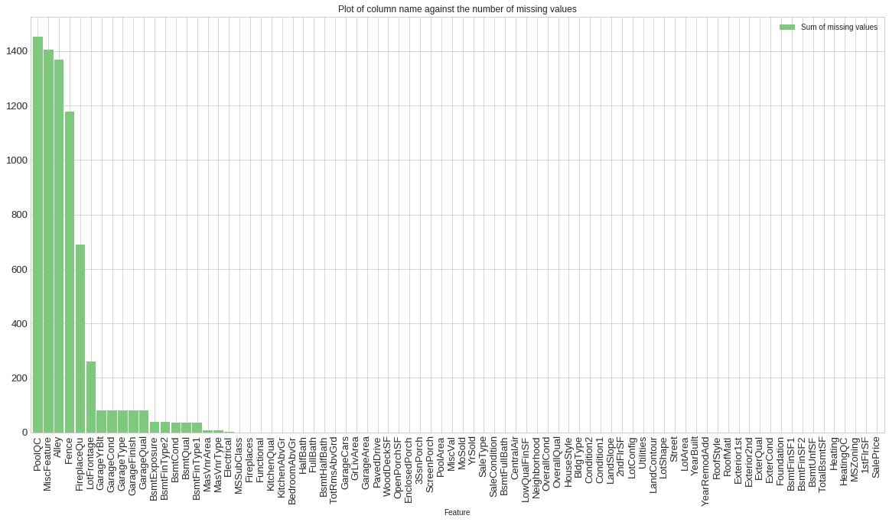


#### As we can see, some columns contain an exorbitant amount of missing values , while some-others contain as missing values as little as 1 or 8, relative to the dataset, i am going to drop columns which contain missing values greater than or equal to 37


```python
cut_off_columns=37 #any column with missing values greater than 37 should be dropped

# get the column names of columns with missing values which are greater 37
condition=columns_and_missing_values_count_df['Sum of missing values'] >= cut_off_columns

# get the name of columns which satisfy the condition to be met, incluse salePrice because it is our target
columns_to_drop=columns_and_missing_values_count_df[condition]['Feature'].values.tolist()

print('The columns which are to be disqualified based on high missing value count are:\n')
print(*columns_to_drop,sep=",\t",end=".")
```

    The columns which are to be disqualified based on high missing value count are:
    
    PoolQC,	MiscFeature,	Alley,	Fence,	FireplaceQu,	LotFrontage,	GarageYrBlt,	GarageCond,	GarageType,	GarageFinish,	GarageQual,	BsmtExposure,	BsmtFinType2,	BsmtCond,	BsmtQual,	BsmtFinType1.

#### drop these uninformative features off the dataset


```python
informative_dataset=dataset.drop(columns_to_drop,axis=1)

print(f"There are {informative_dataset.shape[1]} total columns and {informative_dataset.shape[0]} rows in the informative_dataset.") 
print(f"As we can see, we have just dropped {len(columns_to_drop)} uninformative columns.")

informative_dataset
```

    There are 64 total columns and 1460 rows in the informative_dataset.
    As we can see, we have just dropped 16 uninformative columns.


<div>
<style scoped>
    .dataframe tbody tr th:only-of-type {
        vertical-align: middle;
    }

    .dataframe tbody tr th {
        vertical-align: top;
    }

    .dataframe thead th {
        text-align: right;
    }
</style>
<table border="1" class="dataframe">
  <thead>
    <tr style="text-align: right;">
      <th></th>
      <th>MSSubClass</th>
      <th>MSZoning</th>
      <th>LotArea</th>
      <th>Street</th>
      <th>LotShape</th>
      <th>LandContour</th>
      <th>Utilities</th>
      <th>LotConfig</th>
      <th>LandSlope</th>
      <th>Neighborhood</th>
      <th>...</th>
      <th>EnclosedPorch</th>
      <th>3SsnPorch</th>
      <th>ScreenPorch</th>
      <th>PoolArea</th>
      <th>MiscVal</th>
      <th>MoSold</th>
      <th>YrSold</th>
      <th>SaleType</th>
      <th>SaleCondition</th>
      <th>SalePrice</th>
    </tr>
  </thead>
  <tbody>
    <tr>
      <td>0</td>
      <td>60</td>
      <td>RL</td>
      <td>8450</td>
      <td>Pave</td>
      <td>Reg</td>
      <td>Lvl</td>
      <td>AllPub</td>
      <td>Inside</td>
      <td>Gtl</td>
      <td>CollgCr</td>
      <td>...</td>
      <td>0</td>
      <td>0</td>
      <td>0</td>
      <td>0</td>
      <td>0</td>
      <td>2</td>
      <td>2008</td>
      <td>WD</td>
      <td>Normal</td>
      <td>208500</td>
    </tr>
    <tr>
      <td>1</td>
      <td>20</td>
      <td>RL</td>
      <td>9600</td>
      <td>Pave</td>
      <td>Reg</td>
      <td>Lvl</td>
      <td>AllPub</td>
      <td>FR2</td>
      <td>Gtl</td>
      <td>Veenker</td>
      <td>...</td>
      <td>0</td>
      <td>0</td>
      <td>0</td>
      <td>0</td>
      <td>0</td>
      <td>5</td>
      <td>2007</td>
      <td>WD</td>
      <td>Normal</td>
      <td>181500</td>
    </tr>
    <tr>
      <td>2</td>
      <td>60</td>
      <td>RL</td>
      <td>11250</td>
      <td>Pave</td>
      <td>IR1</td>
      <td>Lvl</td>
      <td>AllPub</td>
      <td>Inside</td>
      <td>Gtl</td>
      <td>CollgCr</td>
      <td>...</td>
      <td>0</td>
      <td>0</td>
      <td>0</td>
      <td>0</td>
      <td>0</td>
      <td>9</td>
      <td>2008</td>
      <td>WD</td>
      <td>Normal</td>
      <td>223500</td>
    </tr>
    <tr>
      <td>3</td>
      <td>70</td>
      <td>RL</td>
      <td>9550</td>
      <td>Pave</td>
      <td>IR1</td>
      <td>Lvl</td>
      <td>AllPub</td>
      <td>Corner</td>
      <td>Gtl</td>
      <td>Crawfor</td>
      <td>...</td>
      <td>272</td>
      <td>0</td>
      <td>0</td>
      <td>0</td>
      <td>0</td>
      <td>2</td>
      <td>2006</td>
      <td>WD</td>
      <td>Abnorml</td>
      <td>140000</td>
    </tr>
    <tr>
      <td>4</td>
      <td>60</td>
      <td>RL</td>
      <td>14260</td>
      <td>Pave</td>
      <td>IR1</td>
      <td>Lvl</td>
      <td>AllPub</td>
      <td>FR2</td>
      <td>Gtl</td>
      <td>NoRidge</td>
      <td>...</td>
      <td>0</td>
      <td>0</td>
      <td>0</td>
      <td>0</td>
      <td>0</td>
      <td>12</td>
      <td>2008</td>
      <td>WD</td>
      <td>Normal</td>
      <td>250000</td>
    </tr>
    <tr>
      <td>...</td>
      <td>...</td>
      <td>...</td>
      <td>...</td>
      <td>...</td>
      <td>...</td>
      <td>...</td>
      <td>...</td>
      <td>...</td>
      <td>...</td>
      <td>...</td>
      <td>...</td>
      <td>...</td>
      <td>...</td>
      <td>...</td>
      <td>...</td>
      <td>...</td>
      <td>...</td>
      <td>...</td>
      <td>...</td>
      <td>...</td>
      <td>...</td>
    </tr>
    <tr>
      <td>1455</td>
      <td>60</td>
      <td>RL</td>
      <td>7917</td>
      <td>Pave</td>
      <td>Reg</td>
      <td>Lvl</td>
      <td>AllPub</td>
      <td>Inside</td>
      <td>Gtl</td>
      <td>Gilbert</td>
      <td>...</td>
      <td>0</td>
      <td>0</td>
      <td>0</td>
      <td>0</td>
      <td>0</td>
      <td>8</td>
      <td>2007</td>
      <td>WD</td>
      <td>Normal</td>
      <td>175000</td>
    </tr>
    <tr>
      <td>1456</td>
      <td>20</td>
      <td>RL</td>
      <td>13175</td>
      <td>Pave</td>
      <td>Reg</td>
      <td>Lvl</td>
      <td>AllPub</td>
      <td>Inside</td>
      <td>Gtl</td>
      <td>NWAmes</td>
      <td>...</td>
      <td>0</td>
      <td>0</td>
      <td>0</td>
      <td>0</td>
      <td>0</td>
      <td>2</td>
      <td>2010</td>
      <td>WD</td>
      <td>Normal</td>
      <td>210000</td>
    </tr>
    <tr>
      <td>1457</td>
      <td>70</td>
      <td>RL</td>
      <td>9042</td>
      <td>Pave</td>
      <td>Reg</td>
      <td>Lvl</td>
      <td>AllPub</td>
      <td>Inside</td>
      <td>Gtl</td>
      <td>Crawfor</td>
      <td>...</td>
      <td>0</td>
      <td>0</td>
      <td>0</td>
      <td>0</td>
      <td>2500</td>
      <td>5</td>
      <td>2010</td>
      <td>WD</td>
      <td>Normal</td>
      <td>266500</td>
    </tr>
    <tr>
      <td>1458</td>
      <td>20</td>
      <td>RL</td>
      <td>9717</td>
      <td>Pave</td>
      <td>Reg</td>
      <td>Lvl</td>
      <td>AllPub</td>
      <td>Inside</td>
      <td>Gtl</td>
      <td>NAmes</td>
      <td>...</td>
      <td>112</td>
      <td>0</td>
      <td>0</td>
      <td>0</td>
      <td>0</td>
      <td>4</td>
      <td>2010</td>
      <td>WD</td>
      <td>Normal</td>
      <td>142125</td>
    </tr>
    <tr>
      <td>1459</td>
      <td>20</td>
      <td>RL</td>
      <td>9937</td>
      <td>Pave</td>
      <td>Reg</td>
      <td>Lvl</td>
      <td>AllPub</td>
      <td>Inside</td>
      <td>Gtl</td>
      <td>Edwards</td>
      <td>...</td>
      <td>0</td>
      <td>0</td>
      <td>0</td>
      <td>0</td>
      <td>0</td>
      <td>6</td>
      <td>2008</td>
      <td>WD</td>
      <td>Normal</td>
      <td>147500</td>
    </tr>
  </tbody>
</table>
<p>1460 rows × 64 columns</p>
</div>


### Another measure for this degree of information a column contains: we are going to measure this based on the correlation of other columns with the target variable 'salesPrice', this will only hold effect over columns whose data-types are continous in nature

#### Plot the correlation of other datatypes against the salePrice feature


```python
title="correlation of All features to the salePrice feature"

# derive the correlation matrix of the informative dataset
full_correlation_matrix=informative_dataset.corr()

# get the correlation of other features with respect to the target variable 'salePrice'
correlation_matrix=full_correlation_matrix['SalePrice'].sort_values(ascending=False)

# plot the correlation of each feature with sales price, in descending order
correlation_matrix.plot(kind="bar",title=title,colormap="Blues_r",**kwargs)
plt.plot()
```


    []


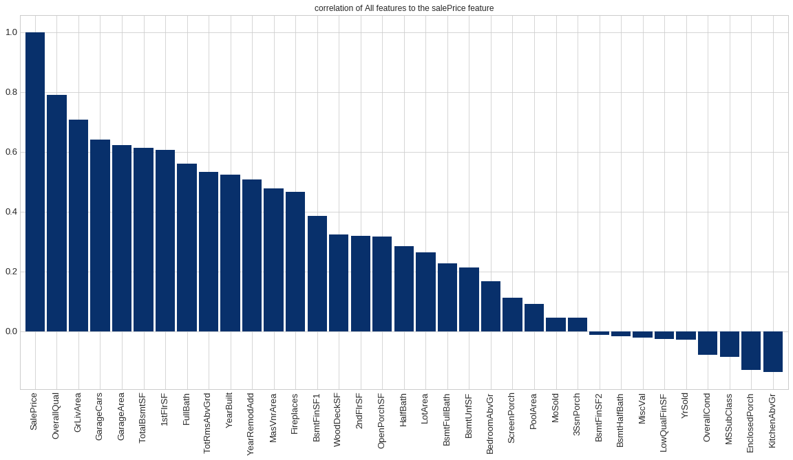


#### From this graph I derive a cut off value of 0.4, any feature whose correlation with the target is less than 0.4 should be cut off, as it is not correlated enough annd could be noise in the data


```python
cut_off_columns=0.2 #any column with a correlation less than 0.2 should be dropped

# get the column names of columns with correlation less than 0.4
condition=correlation_matrix <= cut_off_columns

# get the name of columns which satisfy the condition to be met
columns_to_drop=correlation_matrix[condition].index.tolist()

print('The columns which are to be disqualified based on Low correlation(<0.4) to target are:\n')
print(*columns_to_drop,sep=",\t",end=".")
```

    The columns which are to be disqualified based on Low correlation(<0.4) to target are:
    
    BedroomAbvGr,	ScreenPorch,	PoolArea,	MoSold,	3SsnPorch,	BsmtFinSF2,	BsmtHalfBath,	MiscVal,	LowQualFinSF,	YrSold,	OverallCond,	MSSubClass,	EnclosedPorch,	KitchenAbvGr.

#### Drop these columns from the dataset


```python
informative_dataset=informative_dataset.drop(columns_to_drop,axis=1,errors='ignore')

print(f"There are {informative_dataset.shape[1]} total columns and {informative_dataset.shape[0]} rows in the informative_dataset.") 
print(f"As we can see, we have just dropped {len(columns_to_drop)} uninformative columns.")

informative_dataset
```

    There are 50 total columns and 1460 rows in the informative_dataset.
    As we can see, we have just dropped 14 uninformative columns.


<div>
<style scoped>
    .dataframe tbody tr th:only-of-type {
        vertical-align: middle;
    }

    .dataframe tbody tr th {
        vertical-align: top;
    }

    .dataframe thead th {
        text-align: right;
    }
</style>
<table border="1" class="dataframe">
  <thead>
    <tr style="text-align: right;">
      <th></th>
      <th>MSZoning</th>
      <th>LotArea</th>
      <th>Street</th>
      <th>LotShape</th>
      <th>LandContour</th>
      <th>Utilities</th>
      <th>LotConfig</th>
      <th>LandSlope</th>
      <th>Neighborhood</th>
      <th>Condition1</th>
      <th>...</th>
      <th>Functional</th>
      <th>Fireplaces</th>
      <th>GarageCars</th>
      <th>GarageArea</th>
      <th>PavedDrive</th>
      <th>WoodDeckSF</th>
      <th>OpenPorchSF</th>
      <th>SaleType</th>
      <th>SaleCondition</th>
      <th>SalePrice</th>
    </tr>
  </thead>
  <tbody>
    <tr>
      <td>0</td>
      <td>RL</td>
      <td>8450</td>
      <td>Pave</td>
      <td>Reg</td>
      <td>Lvl</td>
      <td>AllPub</td>
      <td>Inside</td>
      <td>Gtl</td>
      <td>CollgCr</td>
      <td>Norm</td>
      <td>...</td>
      <td>Typ</td>
      <td>0</td>
      <td>2</td>
      <td>548</td>
      <td>Y</td>
      <td>0</td>
      <td>61</td>
      <td>WD</td>
      <td>Normal</td>
      <td>208500</td>
    </tr>
    <tr>
      <td>1</td>
      <td>RL</td>
      <td>9600</td>
      <td>Pave</td>
      <td>Reg</td>
      <td>Lvl</td>
      <td>AllPub</td>
      <td>FR2</td>
      <td>Gtl</td>
      <td>Veenker</td>
      <td>Feedr</td>
      <td>...</td>
      <td>Typ</td>
      <td>1</td>
      <td>2</td>
      <td>460</td>
      <td>Y</td>
      <td>298</td>
      <td>0</td>
      <td>WD</td>
      <td>Normal</td>
      <td>181500</td>
    </tr>
    <tr>
      <td>2</td>
      <td>RL</td>
      <td>11250</td>
      <td>Pave</td>
      <td>IR1</td>
      <td>Lvl</td>
      <td>AllPub</td>
      <td>Inside</td>
      <td>Gtl</td>
      <td>CollgCr</td>
      <td>Norm</td>
      <td>...</td>
      <td>Typ</td>
      <td>1</td>
      <td>2</td>
      <td>608</td>
      <td>Y</td>
      <td>0</td>
      <td>42</td>
      <td>WD</td>
      <td>Normal</td>
      <td>223500</td>
    </tr>
    <tr>
      <td>3</td>
      <td>RL</td>
      <td>9550</td>
      <td>Pave</td>
      <td>IR1</td>
      <td>Lvl</td>
      <td>AllPub</td>
      <td>Corner</td>
      <td>Gtl</td>
      <td>Crawfor</td>
      <td>Norm</td>
      <td>...</td>
      <td>Typ</td>
      <td>1</td>
      <td>3</td>
      <td>642</td>
      <td>Y</td>
      <td>0</td>
      <td>35</td>
      <td>WD</td>
      <td>Abnorml</td>
      <td>140000</td>
    </tr>
    <tr>
      <td>4</td>
      <td>RL</td>
      <td>14260</td>
      <td>Pave</td>
      <td>IR1</td>
      <td>Lvl</td>
      <td>AllPub</td>
      <td>FR2</td>
      <td>Gtl</td>
      <td>NoRidge</td>
      <td>Norm</td>
      <td>...</td>
      <td>Typ</td>
      <td>1</td>
      <td>3</td>
      <td>836</td>
      <td>Y</td>
      <td>192</td>
      <td>84</td>
      <td>WD</td>
      <td>Normal</td>
      <td>250000</td>
    </tr>
    <tr>
      <td>...</td>
      <td>...</td>
      <td>...</td>
      <td>...</td>
      <td>...</td>
      <td>...</td>
      <td>...</td>
      <td>...</td>
      <td>...</td>
      <td>...</td>
      <td>...</td>
      <td>...</td>
      <td>...</td>
      <td>...</td>
      <td>...</td>
      <td>...</td>
      <td>...</td>
      <td>...</td>
      <td>...</td>
      <td>...</td>
      <td>...</td>
      <td>...</td>
    </tr>
    <tr>
      <td>1455</td>
      <td>RL</td>
      <td>7917</td>
      <td>Pave</td>
      <td>Reg</td>
      <td>Lvl</td>
      <td>AllPub</td>
      <td>Inside</td>
      <td>Gtl</td>
      <td>Gilbert</td>
      <td>Norm</td>
      <td>...</td>
      <td>Typ</td>
      <td>1</td>
      <td>2</td>
      <td>460</td>
      <td>Y</td>
      <td>0</td>
      <td>40</td>
      <td>WD</td>
      <td>Normal</td>
      <td>175000</td>
    </tr>
    <tr>
      <td>1456</td>
      <td>RL</td>
      <td>13175</td>
      <td>Pave</td>
      <td>Reg</td>
      <td>Lvl</td>
      <td>AllPub</td>
      <td>Inside</td>
      <td>Gtl</td>
      <td>NWAmes</td>
      <td>Norm</td>
      <td>...</td>
      <td>Min1</td>
      <td>2</td>
      <td>2</td>
      <td>500</td>
      <td>Y</td>
      <td>349</td>
      <td>0</td>
      <td>WD</td>
      <td>Normal</td>
      <td>210000</td>
    </tr>
    <tr>
      <td>1457</td>
      <td>RL</td>
      <td>9042</td>
      <td>Pave</td>
      <td>Reg</td>
      <td>Lvl</td>
      <td>AllPub</td>
      <td>Inside</td>
      <td>Gtl</td>
      <td>Crawfor</td>
      <td>Norm</td>
      <td>...</td>
      <td>Typ</td>
      <td>2</td>
      <td>1</td>
      <td>252</td>
      <td>Y</td>
      <td>0</td>
      <td>60</td>
      <td>WD</td>
      <td>Normal</td>
      <td>266500</td>
    </tr>
    <tr>
      <td>1458</td>
      <td>RL</td>
      <td>9717</td>
      <td>Pave</td>
      <td>Reg</td>
      <td>Lvl</td>
      <td>AllPub</td>
      <td>Inside</td>
      <td>Gtl</td>
      <td>NAmes</td>
      <td>Norm</td>
      <td>...</td>
      <td>Typ</td>
      <td>0</td>
      <td>1</td>
      <td>240</td>
      <td>Y</td>
      <td>366</td>
      <td>0</td>
      <td>WD</td>
      <td>Normal</td>
      <td>142125</td>
    </tr>
    <tr>
      <td>1459</td>
      <td>RL</td>
      <td>9937</td>
      <td>Pave</td>
      <td>Reg</td>
      <td>Lvl</td>
      <td>AllPub</td>
      <td>Inside</td>
      <td>Gtl</td>
      <td>Edwards</td>
      <td>Norm</td>
      <td>...</td>
      <td>Typ</td>
      <td>0</td>
      <td>1</td>
      <td>276</td>
      <td>Y</td>
      <td>736</td>
      <td>68</td>
      <td>WD</td>
      <td>Normal</td>
      <td>147500</td>
    </tr>
  </tbody>
</table>
<p>1460 rows × 50 columns</p>
</div>


### After applying statistical methods to decide columns to drop, the next dropping tactic would be to drop uninformative features based on Range and standart deviation

#### Whaich columns are left?
#### Which columns withstood the trials of missing-values and the tribulations of  correlations ?


```python
# get the columns which are left
columns_left=sorted(informative_dataset.columns.sort_values().tolist())

print(f'There are {len(columns_left)} colunms left.\n')
print(*columns_left,sep="    \t")
```

    There are 50 colunms left.
    
    1stFlrSF    	2ndFlrSF    	BldgType    	BsmtFinSF1    	BsmtFullBath    	BsmtUnfSF    	CentralAir    	Condition1    	Condition2    	Electrical    	ExterCond    	ExterQual    	Exterior1st    	Exterior2nd    	Fireplaces    	Foundation    	FullBath    	Functional    	GarageArea    	GarageCars    	GrLivArea    	HalfBath    	Heating    	HeatingQC    	HouseStyle    	KitchenQual    	LandContour    	LandSlope    	LotArea    	LotConfig    	LotShape    	MSZoning    	MasVnrArea    	MasVnrType    	Neighborhood    	OpenPorchSF    	OverallQual    	PavedDrive    	RoofMatl    	RoofStyle    	SaleCondition    	SalePrice    	SaleType    	Street    	TotRmsAbvGrd    	TotalBsmtSF    	Utilities    	WoodDeckSF    	YearBuilt    	YearRemodAdd


## In order to capture informative features we use a strategy explained hence:
#### We first group the entire dataset by that feature, then calculate the averagr salePrice for each group. the obeserve the range(max-min) and the standard devation of the salesPrice of each feature's category.
#### Informative features with respect to 'SalePrice' are features which would have a high range(i.e the difference between the highest and lowest value in the group is wide), because each category should have a linearly increasing large impact on the salePrice
#### Informative features should as well have a well above average deviation because the increasing impact of each feature should be felt on the price and make large strides in the price, so the average price of each category in the feature should very well differ from the average price of the next category in that feature
#### this idea can be shown as below to prove that informative features have high range and high standard deviation:


```python
# informative feature
# we firstgroup the dataset by our currently most correlated continous feature 'OverallQual'
quality_group=dataset.groupby("OverallQual")["SalePrice"].mean().sort_values()
mean_price_per_group=quality_group.values
range_val=mean_price_per_group.max() - mean_price_per_group.min()
std=mean_price_per_group.std()

quality_group.plot(kind="bar")
plt.plot()
print("range:",commaSeperate(range_val))
print("std:",commaSeperate(std))
```

    range: 388,438.39
    std: 126,726.12


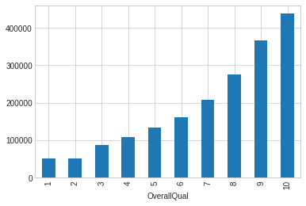


#### we can see that an informative feature has a wide range and a large standart deviation


```python
# non informative feature
# we firstgroup the dataset by our currently least correlated feature 'KitchenAbvGr'
quality_group=dataset.groupby("KitchenAbvGr")["SalePrice"].mean().sort_values()
mean_price_per_group=quality_group.values
range_val=mean_price_per_group.max() - mean_price_per_group.min()
std=mean_price_per_group.std()

quality_group.plot(kind="bar")
plt.plot()
print("range:",commaSeperate(range_val))
print("std:",commaSeperate(std))
```

    range: 73,888.79
    std: 27,523.80


#### on the contrary we can see that for features that are not highly correlated or informative it has a low range and an even lower standart devaition

### We apply this hypothesis to our remaining features in order to view their standard deviation and range


```python
# a function that returns the feature name, standard deviation and range
def getRangeAndStd(column,target="SalePrice"):
    quality_group=dataset.groupby(column)[target].mean().sort_values()
    mean_price_per_group=quality_group.values
    range_val=mean_price_per_group.max() - mean_price_per_group.min()
    std=mean_price_per_group.std()
    
    return [column,range_val,std]
```

#### Get the range and standard deviation of all the columns remaining


```python
# obtain the range and standard deviation of each feature 
range_and_std=list(map(getRangeAndStd,columns_left))
range_and_std_df=pd.DataFrame(range_and_std,columns=["column name","range","std"]).sort_values(["range","std"],ascending=False)

# calculate the average range and standard deviation for the remaining features
avg_std=range_and_std_df["std"].mean()
avg_range=range_and_std_df["range"].mean()

print("The average standard deviation of sales price among all the remaining features is:",commaSeperate(avg_std))
print("The average range of sales price among all the remaining features is:",commaSeperate(avg_range))


# plot these values on a bar plot
range_and_std_df.plot(x="column name",kind="bar",**kwargs)
plt.xlabel("Slaes Price")
plt.ylabel("Column name")
plt.title("A plot showing the standard deviation and range of all the values of the average sales prices of each feature")
plt.plot()
```

    The average standard deviation of sales price among all the remaining features is: 57,347.76
    The average range of sales price among all the remaining features is: 275,759.89


    []


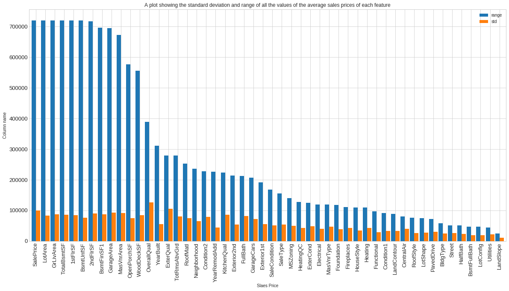


#### Our 'informative features' would be those whose range and standard deviation are aboove the average values
#### Since range and devistion are correlated, i will pick only based on the range, because std wpuld become redundant


```python
#get these columns
import math
# round off the average range to te nearest 100,000
round_avg_range=math.floor(avg_range/100000)*100000

# informative features are ones with a range greater that the average range
analysed_informative_features_rows=range_and_std_df[range_and_std_df["range"] > round_avg_range ]

# the columns gotten from our analysis
analysed_informative_features=analysed_informative_features_rows['column name'].tolist()
```

#### After careful observation of the dataset and some research, i found some columns which i think to be informative, because i would consider them if i were to get a house , although they did not  makee the cut


```python
personal_column=["SaleCondition","SaleType","Electrical",'YrSold']

# create a list containng all of our informative features 
informative_features=analysed_informative_features+personal_column
```

#### Now that we have our informative features, we should get them and their meaning from the data description

### Here they are, they passed the trials of missing values, aced the tribulations of correlations ,braved the depths of deviations and the rocks of ranges. I present .... our champions, THE INFORMATIVE FEATURES


```python
# display the informative columns and a brief description so i can understand what i am working with
print(f"{len(informative_features)} INFORMATIVE FEATURES AND THEIR MEANING:\n\n")
for col in informative_features:
    getFeatureMeaning(col)
```

    28 INFORMATIVE FEATURES AND THEIR MEANING:
    
    
    LotArea: Lot size in square feet
    
    GrLivArea: Above grade (ground) living area square feet
    
    TotalBsmtSF: Total square feet of basement area
    
    1stFlrSF: First Floor square feet
    
    BsmtUnfSF: Unfinished square feet of basement area
    
    2ndFlrSF: Second floor square feet
    
    BsmtFinSF1: Type 1 finished square feet
    
    GarageArea: Size of garage in square feet
    
    MasVnrArea: Masonry veneer area in square feet
    
    OpenPorchSF: Open porch area in square feet
    
    WoodDeckSF: Wood deck area in square feet
    
    OverallQual: Rates the overall material and finish of the house
    
    YearBuilt: Original construction date
    
    ExterQual: Evaluates the quality of the material on the exterior 
    
    TotRmsAbvGrd: Total rooms above grade (does not include bathrooms)
    
    RoofMatl: Roof material
    
    Neighborhood: Physical locations within Ames city limits
    
    Condition2: Proximity to various conditions (if more than one is present)
    
    YearRemodAdd: Remodel date (same as construction date if no remodeling or additions)
    
    KitchenQual: Kitchen quality
    
    Exterior2nd: Exterior covering on house (if more than one material)
    
    FullBath: Full bathrooms above grade
    
    GarageCars: Size of garage in car capacity
    
    SaleCondition: Condition of sale
    
    SaleType: Type of sale
    
    Electrical: Electrical system
    
    YrSold: Year Sold (YYYY)
    


# Exploratory data analysis
## The purpose of this analysis is to understand how the variables in the dataset relates to the sales Price

### Now tht we have our informative featuress, we now observe the relationships between variables, themselves and the target variables.
### Stay tuned, The fun has just began.


```python
# create a dataframe containing only the informative features
informative_dataset=dataset[informative_features]
```

### Now, to explore the relationships between the dataset, we need to divide the features into categorical and continous features for ease in analysis. Before that  i need to check for missing values and develop a stretegy for filling them.


```python
for feature_name in informative_dataset:
    print(f"{feature_name} of type {dataset[feature_name].dtype} with {dataset[feature_name].isnull().sum()} missing values.\n")
```

    SalePrice of type int64 with 0 missing values.
    
    LotArea of type int64 with 0 missing values.
    
    GrLivArea of type int64 with 0 missing values.
    
    TotalBsmtSF of type int64 with 0 missing values.
    
    1stFlrSF of type int64 with 0 missing values.
    
    BsmtUnfSF of type int64 with 0 missing values.
    
    2ndFlrSF of type int64 with 0 missing values.
    
    BsmtFinSF1 of type int64 with 0 missing values.
    
    GarageArea of type int64 with 0 missing values.
    
    MasVnrArea of type float64 with 8 missing values.
    
    OpenPorchSF of type int64 with 0 missing values.
    
    WoodDeckSF of type int64 with 0 missing values.
    
    OverallQual of type int64 with 0 missing values.
    
    YearBuilt of type int64 with 0 missing values.
    
    ExterQual of type object with 0 missing values.
    
    TotRmsAbvGrd of type int64 with 0 missing values.
    
    RoofMatl of type object with 0 missing values.
    
    Neighborhood of type object with 0 missing values.
    
    Condition2 of type object with 0 missing values.
    
    YearRemodAdd of type int64 with 0 missing values.
    
    KitchenQual of type object with 0 missing values.
    
    Exterior2nd of type object with 0 missing values.
    
    FullBath of type int64 with 0 missing values.
    
    GarageCars of type int64 with 0 missing values.
    
    SaleCondition of type object with 0 missing values.
    
    SaleType of type object with 0 missing values.
    
    Electrical of type object with 1 missing values.
    
    YrSold of type int64 with 0 missing values.
    


#### we can see that Electrical has 1 missing value
#### we can also see that MasVnrArea has 8 missing values

#### in order to determine which strategy to fill them with, i first understand the description of the data

#### Since 'Electrical' feature deals with the  electrical system of the house, a proper strategy will be to fill it with the most common one, as most people by default are likely to install the most common electrical system


```python
# get the most common, from electrical since it is a categorical column
informative_dataset['Electrical'].value_counts().plot(kind="bar",**kwargs)
plt.plot()
```


    []


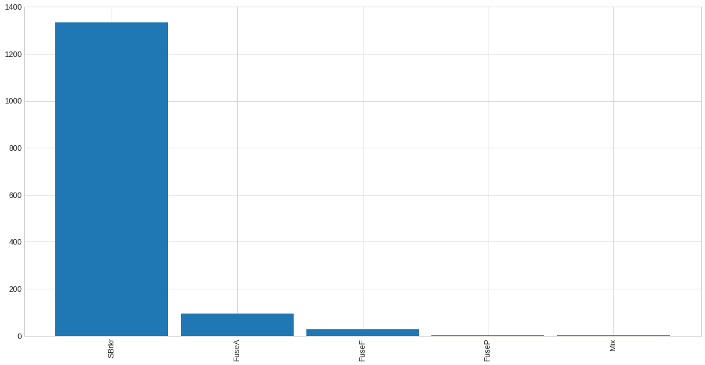


#### we can see that SBrkr is by far most common feature,  coincidentally it  stands for 'Standard Circuit Breakers & Romex' in the data description, we then replace all missing values in electrical feture by it.


```python
# fill in the missing values of the electrical column
informative_dataset['Electrical']=informative_dataset['Electrical'].fillna('SBrkr')
print(f"The number of missing values in ELectrical column is {informative_dataset['Electrical'].isnull().sum()}")
```

    The number of missing values in ELectrical column is 0


#### Since 'MasVnrArea' feature deals with the  area of the property, a measure to fill it would be the average value


```python
average_area=informative_dataset['MasVnrArea'].mean()
informative_dataset['MasVnrArea']=informative_dataset['MasVnrArea'].fillna(average_area)
print(f"The number of missing values in ELectrical column is {informative_dataset['Electrical'].isnull().sum()}")
```

    The number of missing values in ELectrical column is 0


### Split the column into categorical and continous


```python
categorical=[
    "ExterQual","RoofMatl","Neighborhood","Condition2","KitchenQual","Exterior2nd","SaleCondition"
]

# continous featuers are ones which are in our informative variables but not in continous
continous=[
    feature for feature in informative_features if feature not in categorical
]
```

### Analyse the numerical dataset

#### firstly let us understand the distribution and dispersion of the target variable as well as the values it can take


```python
informative_dataset['SalePrice'].plot(kind="hist",figsize=(20,10),fontsize= 15,rot=35)
plt.title("Histogram Distribution of the salePrice of the houses")
plt.xlabel("sale price")
plt.plot()
```


    []


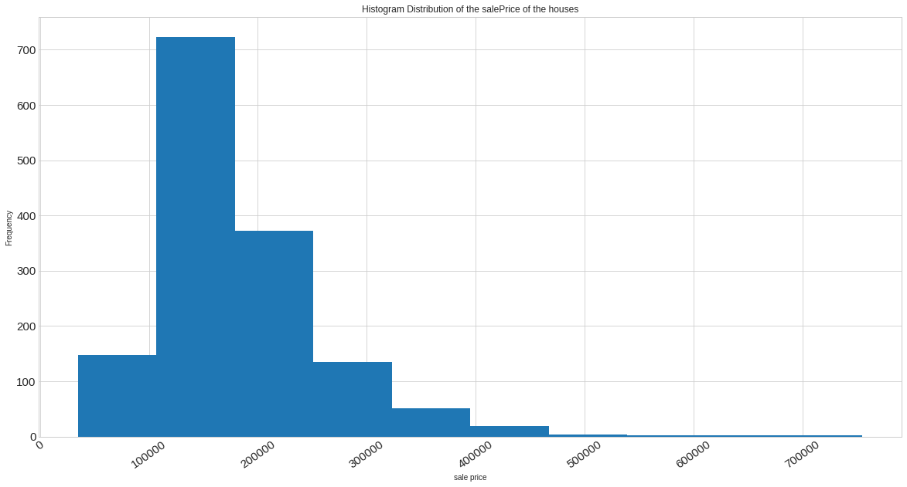


#### From this visualisation we can see that the salePrice is slightly skewed to the left and more houses are more lower priced that they are higher.


```python
# a brief lookup of the datadescription
!cat data_description.txt
```

    MSSubClass: Identifies the type of dwelling involved in the sale.	
    
            20	1-STORY 1946 & NEWER ALL STYLES
            30	1-STORY 1945 & OLDER
            40	1-STORY W/FINISHED ATTIC ALL AGES
            45	1-1/2 STORY - UNFINISHED ALL AGES
            50	1-1/2 STORY FINISHED ALL AGES
            60	2-STORY 1946 & NEWER
            70	2-STORY 1945 & OLDER
            75	2-1/2 STORY ALL AGES
            80	SPLIT OR MULTI-LEVEL
            85	SPLIT FOYER
            90	DUPLEX - ALL STYLES AND AGES
           120	1-STORY PUD (Planned Unit Development) - 1946 & NEWER
           150	1-1/2 STORY PUD - ALL AGES
           160	2-STORY PUD - 1946 & NEWER
           180	PUD - MULTILEVEL - INCL SPLIT LEV/FOYER
           190	2 FAMILY CONVERSION - ALL STYLES AND AGES
    
    MSZoning: Identifies the general zoning classification of the sale.
    		
           A	Agriculture
           C	Commercial
           FV	Floating Village Residential
           I	Industrial
           RH	Residential High Density
           RL	Residential Low Density
           RP	Residential Low Density Park 
           RM	Residential Medium Density
    	
    LotFrontage: Linear feet of street connected to property
    
    LotArea: Lot size in square feet
    
    Street: Type of road access to property
    
           Grvl	Gravel	
           Pave	Paved
           	
    Alley: Type of alley access to property
    
           Grvl	Gravel
           Pave	Paved
           NA 	No alley access
    		
    LotShape: General shape of property
    
           Reg	Regular	
           IR1	Slightly irregular
           IR2	Moderately Irregular
           IR3	Irregular
           
    LandContour: Flatness of the property
    
           Lvl	Near Flat/Level	
           Bnk	Banked - Quick and significant rise from street grade to building
           HLS	Hillside - Significant slope from side to side
           Low	Depression
    		
    Utilities: Type of utilities available
    		
           AllPub	All public Utilities (E,G,W,& S)	
           NoSewr	Electricity, Gas, and Water (Septic Tank)
           NoSeWa	Electricity and Gas Only
           ELO	Electricity only	
    	
    LotConfig: Lot configuration
    
           Inside	Inside lot
           Corner	Corner lot
           CulDSac	Cul-de-sac
           FR2	Frontage on 2 sides of property
           FR3	Frontage on 3 sides of property
    	
    LandSlope: Slope of property
    		
           Gtl	Gentle slope
           Mod	Moderate Slope	
           Sev	Severe Slope
    	
    Neighborhood: Physical locations within Ames city limits
    
           Blmngtn	Bloomington Heights
           Blueste	Bluestem
           BrDale	Briardale
           BrkSide	Brookside
           ClearCr	Clear Creek
           CollgCr	College Creek
           Crawfor	Crawford
           Edwards	Edwards
           Gilbert	Gilbert
           IDOTRR	Iowa DOT and Rail Road
           MeadowV	Meadow Village
           Mitchel	Mitchell
           Names	North Ames
           NoRidge	Northridge
           NPkVill	Northpark Villa
           NridgHt	Northridge Heights
           NWAmes	Northwest Ames
           OldTown	Old Town
           SWISU	South & West of Iowa State University
           Sawyer	Sawyer
           SawyerW	Sawyer West
           Somerst	Somerset
           StoneBr	Stone Brook
           Timber	Timberland
           Veenker	Veenker
    			
    Condition1: Proximity to various conditions
    	
           Artery	Adjacent to arterial street
           Feedr	Adjacent to feeder street	
           Norm	Normal	
           RRNn	Within 200' of North-South Railroad
           RRAn	Adjacent to North-South Railroad
           PosN	Near positive off-site feature--park, greenbelt, etc.
           PosA	Adjacent to postive off-site feature
           RRNe	Within 200' of East-West Railroad
           RRAe	Adjacent to East-West Railroad
    	
    Condition2: Proximity to various conditions (if more than one is present)
    		
           Artery	Adjacent to arterial street
           Feedr	Adjacent to feeder street	
           Norm	Normal	
           RRNn	Within 200' of North-South Railroad
           RRAn	Adjacent to North-South Railroad
           PosN	Near positive off-site feature--park, greenbelt, etc.
           PosA	Adjacent to postive off-site feature
           RRNe	Within 200' of East-West Railroad
           RRAe	Adjacent to East-West Railroad
    	
    BldgType: Type of dwelling
    		
           1Fam	Single-family Detached	
           2FmCon	Two-family Conversion; originally built as one-family dwelling
           Duplx	Duplex
           TwnhsE	Townhouse End Unit
           TwnhsI	Townhouse Inside Unit
    	
    HouseStyle: Style of dwelling
    	
           1Story	One story
           1.5Fin	One and one-half story: 2nd level finished
           1.5Unf	One and one-half story: 2nd level unfinished
           2Story	Two story
           2.5Fin	Two and one-half story: 2nd level finished
           2.5Unf	Two and one-half story: 2nd level unfinished
           SFoyer	Split Foyer
           SLvl	Split Level
    	
    OverallQual: Rates the overall material and finish of the house
    
           10	Very Excellent
           9	Excellent
           8	Very Good
           7	Good
           6	Above Average
           5	Average
           4	Below Average
           3	Fair
           2	Poor
           1	Very Poor
    	
    OverallCond: Rates the overall condition of the house
    
           10	Very Excellent
           9	Excellent
           8	Very Good
           7	Good
           6	Above Average	
           5	Average
           4	Below Average	
           3	Fair
           2	Poor
           1	Very Poor
    		
    YearBuilt: Original construction date
    
    YearRemodAdd: Remodel date (same as construction date if no remodeling or additions)
    
    RoofStyle: Type of roof
    
           Flat	Flat
           Gable	Gable
           Gambrel	Gabrel (Barn)
           Hip	Hip
           Mansard	Mansard
           Shed	Shed
    		
    RoofMatl: Roof material
    
           ClyTile	Clay or Tile
           CompShg	Standard (Composite) Shingle
           Membran	Membrane
           Metal	Metal
           Roll	Roll
           Tar&Grv	Gravel & Tar
           WdShake	Wood Shakes
           WdShngl	Wood Shingles
    		
    Exterior1st: Exterior covering on house
    
           AsbShng	Asbestos Shingles
           AsphShn	Asphalt Shingles
           BrkComm	Brick Common
           BrkFace	Brick Face
           CBlock	Cinder Block
           CemntBd	Cement Board
           HdBoard	Hard Board
           ImStucc	Imitation Stucco
           MetalSd	Metal Siding
           Other	Other
           Plywood	Plywood
           PreCast	PreCast	
           Stone	Stone
           Stucco	Stucco
           VinylSd	Vinyl Siding
           Wd Sdng	Wood Siding
           WdShing	Wood Shingles
    	
    Exterior2nd: Exterior covering on house (if more than one material)
    
           AsbShng	Asbestos Shingles
           AsphShn	Asphalt Shingles
           BrkComm	Brick Common
           BrkFace	Brick Face
           CBlock	Cinder Block
           CemntBd	Cement Board
           HdBoard	Hard Board
           ImStucc	Imitation Stucco
           MetalSd	Metal Siding
           Other	Other
           Plywood	Plywood
           PreCast	PreCast
           Stone	Stone
           Stucco	Stucco
           VinylSd	Vinyl Siding
           Wd Sdng	Wood Siding
           WdShing	Wood Shingles
    	
    MasVnrType: Masonry veneer type
    
           BrkCmn	Brick Common
           BrkFace	Brick Face
           CBlock	Cinder Block
           None	None
           Stone	Stone
    	
    MasVnrArea: Masonry veneer area in square feet
    
    ExterQual: Evaluates the quality of the material on the exterior 
    		
           Ex	Excellent
           Gd	Good
           TA	Average/Typical
           Fa	Fair
           Po	Poor
    		
    ExterCond: Evaluates the present condition of the material on the exterior
    		
           Ex	Excellent
           Gd	Good
           TA	Average/Typical
           Fa	Fair
           Po	Poor
    		
    Foundation: Type of foundation
    		
           BrkTil	Brick & Tile
           CBlock	Cinder Block
           PConc	Poured Contrete	
           Slab	Slab
           Stone	Stone
           Wood	Wood
    		
    BsmtQual: Evaluates the height of the basement
    
           Ex	Excellent (100+ inches)	
           Gd	Good (90-99 inches)
           TA	Typical (80-89 inches)
           Fa	Fair (70-79 inches)
           Po	Poor (<70 inches
           NA	No Basement
    		
    BsmtCond: Evaluates the general condition of the basement
    
           Ex	Excellent
           Gd	Good
           TA	Typical - slight dampness allowed
           Fa	Fair - dampness or some cracking or settling
           Po	Poor - Severe cracking, settling, or wetness
           NA	No Basement
    	
    BsmtExposure: Refers to walkout or garden level walls
    
           Gd	Good Exposure
           Av	Average Exposure (split levels or foyers typically score average or above)	
           Mn	Mimimum Exposure
           No	No Exposure
           NA	No Basement
    	
    BsmtFinType1: Rating of basement finished area
    
           GLQ	Good Living Quarters
           ALQ	Average Living Quarters
           BLQ	Below Average Living Quarters	
           Rec	Average Rec Room
           LwQ	Low Quality
           Unf	Unfinshed
           NA	No Basement
    		
    BsmtFinSF1: Type 1 finished square feet
    
    BsmtFinType2: Rating of basement finished area (if multiple types)
    
           GLQ	Good Living Quarters
           ALQ	Average Living Quarters
           BLQ	Below Average Living Quarters	
           Rec	Average Rec Room
           LwQ	Low Quality
           Unf	Unfinshed
           NA	No Basement
    
    BsmtFinSF2: Type 2 finished square feet
    
    BsmtUnfSF: Unfinished square feet of basement area
    
    TotalBsmtSF: Total square feet of basement area
    
    Heating: Type of heating
    		
           Floor	Floor Furnace
           GasA	Gas forced warm air furnace
           GasW	Gas hot water or steam heat
           Grav	Gravity furnace	
           OthW	Hot water or steam heat other than gas
           Wall	Wall furnace
    		
    HeatingQC: Heating quality and condition
    
           Ex	Excellent
           Gd	Good
           TA	Average/Typical
           Fa	Fair
           Po	Poor
    		
    CentralAir: Central air conditioning
    
           N	No
           Y	Yes
    		
    Electrical: Electrical system
    
           SBrkr	Standard Circuit Breakers & Romex
           FuseA	Fuse Box over 60 AMP and all Romex wiring (Average)	
           FuseF	60 AMP Fuse Box and mostly Romex wiring (Fair)
           FuseP	60 AMP Fuse Box and mostly knob & tube wiring (poor)
           Mix	Mixed
    		
    1stFlrSF: First Floor square feet
     
    2ndFlrSF: Second floor square feet
    
    LowQualFinSF: Low quality finished square feet (all floors)
    
    GrLivArea: Above grade (ground) living area square feet
    
    BsmtFullBath: Basement full bathrooms
    
    BsmtHalfBath: Basement half bathrooms
    
    FullBath: Full bathrooms above grade
    
    HalfBath: Half baths above grade
    
    Bedroom: Bedrooms above grade (does NOT include basement bedrooms)
    
    Kitchen: Kitchens above grade
    
    KitchenQual: Kitchen quality
    
           Ex	Excellent
           Gd	Good
           TA	Typical/Average
           Fa	Fair
           Po	Poor
           	
    TotRmsAbvGrd: Total rooms above grade (does not include bathrooms)
    
    Functional: Home functionality (Assume typical unless deductions are warranted)
    
           Typ	Typical Functionality
           Min1	Minor Deductions 1
           Min2	Minor Deductions 2
           Mod	Moderate Deductions
           Maj1	Major Deductions 1
           Maj2	Major Deductions 2
           Sev	Severely Damaged
           Sal	Salvage only
    		
    Fireplaces: Number of fireplaces
    
    FireplaceQu: Fireplace quality
    
           Ex	Excellent - Exceptional Masonry Fireplace
           Gd	Good - Masonry Fireplace in main level
           TA	Average - Prefabricated Fireplace in main living area or Masonry Fireplace in basement
           Fa	Fair - Prefabricated Fireplace in basement
           Po	Poor - Ben Franklin Stove
           NA	No Fireplace
    		
    GarageType: Garage location
    		
           2Types	More than one type of garage
           Attchd	Attached to home
           Basment	Basement Garage
           BuiltIn	Built-In (Garage part of house - typically has room above garage)
           CarPort	Car Port
           Detchd	Detached from home
           NA	No Garage
    		
    GarageYrBlt: Year garage was built
    		
    GarageFinish: Interior finish of the garage
    
           Fin	Finished
           RFn	Rough Finished	
           Unf	Unfinished
           NA	No Garage
    		
    GarageCars: Size of garage in car capacity
    
    GarageArea: Size of garage in square feet
    
    GarageQual: Garage quality
    
           Ex	Excellent
           Gd	Good
           TA	Typical/Average
           Fa	Fair
           Po	Poor
           NA	No Garage
    		
    GarageCond: Garage condition
    
           Ex	Excellent
           Gd	Good
           TA	Typical/Average
           Fa	Fair
           Po	Poor
           NA	No Garage
    		
    PavedDrive: Paved driveway
    
           Y	Paved 
           P	Partial Pavement
           N	Dirt/Gravel
    		
    WoodDeckSF: Wood deck area in square feet
    
    OpenPorchSF: Open porch area in square feet
    
    EnclosedPorch: Enclosed porch area in square feet
    
    3SsnPorch: Three season porch area in square feet
    
    ScreenPorch: Screen porch area in square feet
    
    PoolArea: Pool area in square feet
    
    PoolQC: Pool quality
    		
           Ex	Excellent
           Gd	Good
           TA	Average/Typical
           Fa	Fair
           NA	No Pool
    		
    Fence: Fence quality
    		
           GdPrv	Good Privacy
           MnPrv	Minimum Privacy
           GdWo	Good Wood
           MnWw	Minimum Wood/Wire
           NA	No Fence
    	
    MiscFeature: Miscellaneous feature not covered in other categories
    		
           Elev	Elevator
           Gar2	2nd Garage (if not described in garage section)
           Othr	Other
           Shed	Shed (over 100 SF)
           TenC	Tennis Court
           NA	None
    		
    MiscVal: $Value of miscellaneous feature
    
    MoSold: Month Sold (MM)
    
    YrSold: Year Sold (YYYY)
    
    SaleType: Type of sale
    		
           WD 	Warranty Deed - Conventional
           CWD	Warranty Deed - Cash
           VWD	Warranty Deed - VA Loan
           New	Home just constructed and sold
           COD	Court Officer Deed/Estate
           Con	Contract 15% Down payment regular terms
           ConLw	Contract Low Down payment and low interest
           ConLI	Contract Low Interest
           ConLD	Contract Low Down
           Oth	Other
    		
    SaleCondition: Condition of sale
    
           Normal	Normal Sale
           Abnorml	Abnormal Sale -  trade, foreclosure, short sale
           AdjLand	Adjoining Land Purchase
           Alloca	Allocation - two linked properties with separate deeds, typically condo with a garage unit	
           Family	Sale between family members
           Partial	Home was not completed when last assessed (associated with New Homes)


#### Properly understanding all our numerical features


```python
# plotting all our numerical variables in prder to note some points about them
informative_dataset[continous].hist(bins=15, figsize=(15,15), layout=(5, 4));
```


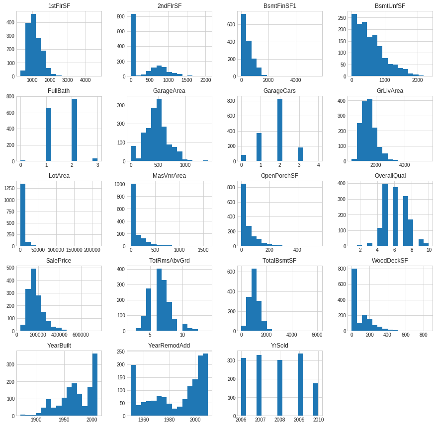


```python
getFeatureMeaning('BsmtUnfSF')
```

    BsmtUnfSF: Unfinished square feet of basement area
    


#### i was a little scared of the BsmtUnfSF feature which appeared to have most of its values towards it's head, but since it stands for unifinished square feet, the observation is actually a good thing


```python
getFeatureMeaning("1stFlrSF")
```

    1stFlrSF: First Floor square feet
    


#### we can also see that the houses reducecd drastically in 2010, i should investigate further into the cause of this


```python
dataset[dataset['YrSold'] == 2010].groupby('MoSold')['YrSold'].count()
```


    MoSold
    1    10
    2    15
    3    21
    4    39
    5    48
    6    36
    7     6
    Name: YrSold, dtype: int64


#### we can see that data was only collected up to july 2010, thus if we were to build a model under the assumption that there was a decrease in sales during 2010. that would be a very naive bayes(bias)!

### From this graph a few things can be observed  about the houses
#### Most houses have a first floor square feet of between one thousand to two thousand
#### Most houses do not have a second floor( I think having second floors moght actually have a strong impact on prices)
#### Most of our sold houses had an overall quality of 5 or higher
#### The lot area looks like it has a few outliers that might need to be removed before any modelling
#### Most houses were built more recently
#### The garage area follows a normal distribution which is a good thing as it means our garageArea is well balanced

### Analyse the categorical features


```python
# use several plots to display our categorical columns

figure, axes = plt.subplots(3, 3,figsize=(15, 25))

for variable, subplot in zip(categorical, axes.flatten()):
    sns.countplot(informative_dataset[variable], ax=subplot)
    for label in subplot.get_xticklabels():
        label.set_rotation(45)
```


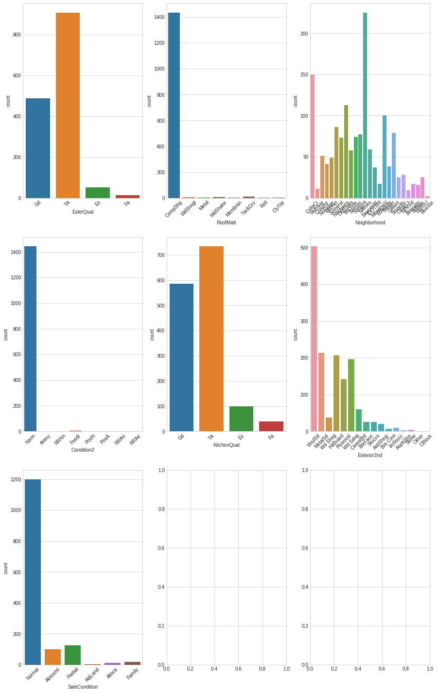


### From the above graphs a few things can be observed  about the houses
#### Most houses have an external quality of TA (this means typical or average) as expected
#### Most houses reside in a particulan neighborhood ''NridgHt	Northridge Heights"

## Analyzing Relationships Between Numerical Variables and categorical variables, in order to determine the most closely related to salePrice

### categorical variables and sale price


```python
fig, ax = plt.subplots(3, 2, figsize=(15, 25))
for var, subplot in zip(categorical, ax.flatten()):
    sns.boxplot(x=var, y='SalePrice', data=dataset, ax=subplot)
    try:
        plt.setp(subplot.get_xticklabels(), rotation=55)
    except:
        pass

```


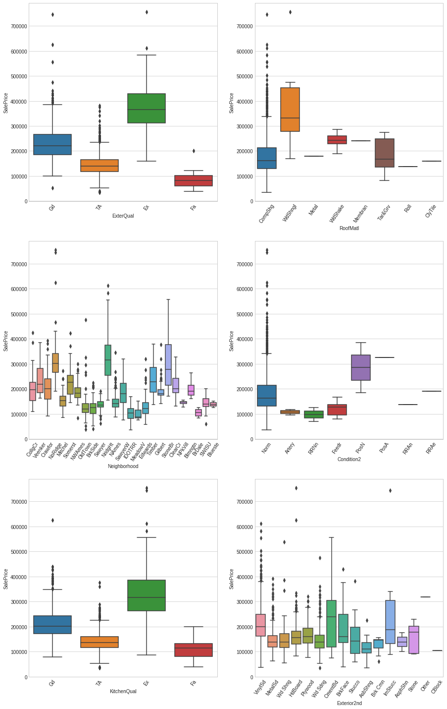


#### Here, we have iterated through every subplot to produce the visualization between all categorical variables and the SalePrice.

#### Using the Candle sticks, we can see that kitchenQual of "Ex" has a high dispersion as well as a far higher average value than the rest of the kind of kitchen features, meaning it has a far better sales price, that all other types, However most other features show less dispersion, meaning there is not a lot of action going on.

#### The neighborhood value has a very interesting distribution, let us focus more on it


```python
# group by neighborhood and sort by saleprice.
sorted_nb = informative_dataset.groupby(['Neighborhood'])['SalePrice'].median().sort_values()

#make the graph beautifull to look at
plt.figure(figsize=(15,8))
ax=sns.boxplot(x=informative_dataset['Neighborhood'], y=informative_dataset['SalePrice'], order=list(sorted_nb.index))
plt.setp(ax.get_xticklabels(), rotation=45)
plt.plot()
```


    []


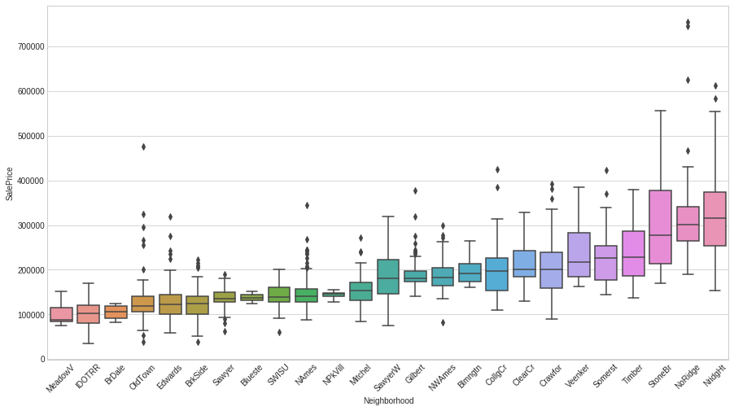


#### This figure gives us a lot of information. We can see that in the cheapest neighborhoods houses sell for a median price of around 100,000 dollars, and in the most expensive neighborhoods houses sell for around 300,000 dollars. We can also see that for some neighborhoods, dispersion between the prices is very low, meaning that all the prices are close to each other. In the most expensive neighborhood NridgHt, however, we see a large box — there is large dispersion in the distribution of prices

### continous variables and sale price


```python
# plotting the correlation of numerical variables with sales price
# adding the [1:] indexer to exclude the sale's price from this bar plot, without it the sales price would be the most correlated feature
informative_dataset.corr()['SalePrice'].sort_values(ascending=False)[1:].plot(kind="bar",**kwargs)
plt.plot()
```


    []


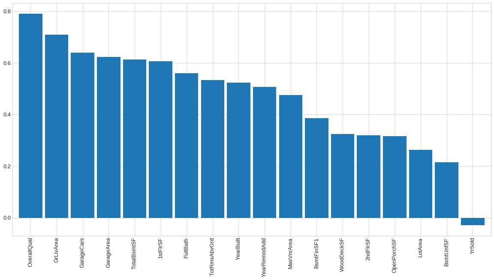


#### We can see that the best descriptive continous feature of the sale price is the overall quality

### Now that we have explored the relationship between variables and saleprice, we are going to cluster the dataset and pick the cluster with the highest mean price and explore the common features


```python
from sklearn.cluster import KMeans
```


```python
# get the informative features values excluding the salePrice, so as not to get biased results when clustering
informative_features_df=informative_dataset
```


```python
# use one hot encoding on the categorical variables to enable us feed them into the algorithm
informative_features_df_encoded=pd.get_dummies(informative_features_df)
```

#### scale the dataset and use PCA to reduce the dimension to visualise if we can easily divide it into clusters


```python
from sklearn.decomposition import PCA
from sklearn.preprocessing import StandardScaler
```


```python
pca=PCA(n_components=2)
scaled_input=StandardScaler().fit_transform(informative_features_df_encoded.values)
components=pca.fit_transform(scaled_input)
```


```python
x_axis=components[:,0]
y_axis=components[:,1]
```


```python
plt.figure(figsize=(15,8))
plt.scatter(x_axis,y_axis,)
plt.plot()
```


    []


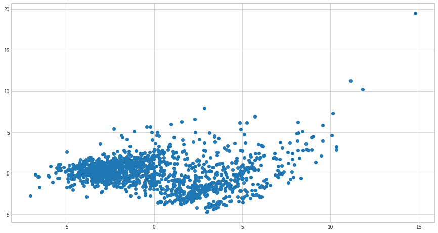


#### using the elbow method to determine the optimum cluster numbers to pick


```python
errors = []
for i in range(1, 11):
    km = KMeans(
        n_clusters=i, init='random',random_state=0
    )
    km.fit(informative_features_df_encoded.values)
    errors.append(km.inertia_)

# plot
plt.figure(figsize=(15,8))
plt.plot(range(1, 11), errors, marker='o')
plt.xlabel('Number of clusters')
plt.ylabel('Distortion')
plt.title("elbow method to determine the optimal clusters, plotting error against number of clusters")
plt.show()
```


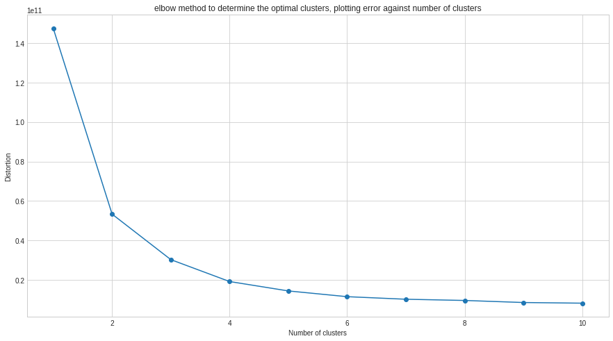


#### Based on the elbow method we can see thta the optimum cluster is 2

#### fit the kmeans model on the encoded dataset using the optimal number of clusters


```python
n_optimum_clusters=2
kmeans=KMeans(n_clusters=n_optimum_clusters, init='random',random_state=0)
kmeans.fit(informative_features_df_encoded)
```


    KMeans(algorithm='auto', copy_x=True, init='random', max_iter=300, n_clusters=2,
           n_init=10, n_jobs=None, precompute_distances='auto', random_state=0,
           tol=0.0001, verbose=0)


#### Predict the clusters each row belongs to


```python
clusters=kmeans.predict(informative_features_df_encoded)
```

### check if our clusters do justice to the dataset


```python
LABEL_COLOR_MAP={0:"red",1:"blue",2:"yellow",3:"black"}
label_color = [LABEL_COLOR_MAP[l] for l in clusters]
plt.figure(figsize=(15,8))
plt.scatter(x_axis, y_axis, c=label_color)
plt.title("reduced dimension dataset colored by clusters")
plt.plot()
```


    []


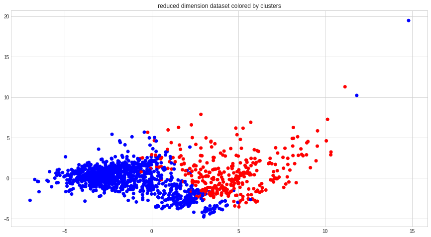


#### we can see some outliers which we would have to remove before machine learning, but our dataset has fairly well seperated clusters, hopefully they seperate price well too


```python
# view the size of each cluster
pd.value_counts(clusters)
```


    1    1125
    0     335
    dtype: int64


```python
# reattach each clusters, to it's original row
informative_dataset['clusters']=clusters
```


```python
# let us see the average pice per cluster
plt.title("AVERAGE PRICE PER CLUSTER")
plt.ylabel("Price")
informative_dataset.groupby(['clusters'])['SalePrice'].mean().plot(kind="bar",**kwargs)
plt.plot()
```


    []


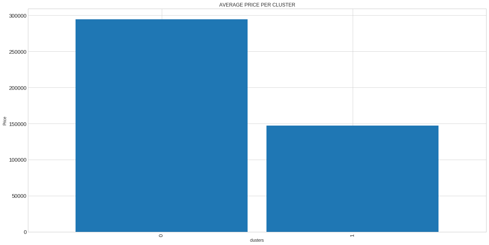


### The final step is to group by each cluster and observe the feature with the highest variance and standard deviation per cluster, because this would mean that this is the feature that had the most effect in the seperation of these clusters which are originally seperated by price


```python
#  a function to give us information about each cluster
# a function that returns the feature name, standard deviation and range
# upon any error, there is no deviation, or negative deviation
def getRangeAndStd(column):
    try:
        quality_group=informative_dataset.groupby(clusters)[column].mean().sort_values()
        mean_price_per_group=quality_group.values
        range_val=mean_price_per_group.max() - mean_price_per_group.min()
        std=mean_price_per_group.std()
    except:
        range_val=std=0

    
    return [column,range_val,std]

# informative_dataset.groupby(clusters)["TotRmsAbvGrd"].mean().sort_values().values.std()
```


```python
# obtain the range and standard deviation of each feature 
range_and_std=list(map(getRangeAndStd,final_features[1:]))
range_and_std_df=pd.DataFrame(range_and_std,columns=["column name","range","std"]).sort_values(["range","std"],ascending=False)

# calculate the average range and standard deviation for the remaining features
avg_std=range_and_std_df["std"].mean()
avg_range=range_and_std_df["range"].mean()

print("The average standard deviation of sales price among all the remaining features is:",commaSeperate(avg_std))
print("The average range of sales price among all the remaining features is:",commaSeperate(avg_range))


# plot these values on a bar plot
range_and_std_df.plot(x="column name",kind="bar",**kwargs)
plt.xlabel("Slaes Price")
plt.ylabel("Column name")
plt.title("A plot showing the standard deviation and range of all the values of the average sales prices of each feature")
plt.plot()
```

    The average standard deviation of sales price among all the remaining features is: 162.46
    The average range of sales price among all the remaining features is: 324.92


    []


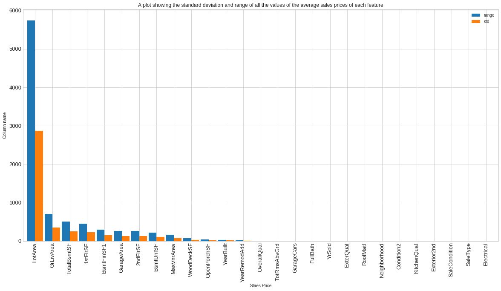


#### Lotarea has by far the highest variance amont all the features

## considering both our total feature analysis using variances, as well as our analysis using correlation to the target variable and now finally using clusters, we can see that the "LotArea" played a major role in all these seperation tactics and it ranked well in all tests.

# I recommend that LotArea has the best description to saleprice, because the larger the lot size the larger the house , and a large lot size implies large cars which would also mean large income to purchase such cars
